**HackPark**

**Objective**

Compromise a Windows machine using Hydra, RCE and WinPEAS.

Gain access to the machine by brute forcing a web login with Hydra. From here the use of RCE and WinPEAS will allow a reverse shell to be open and root access will be gained.


**Brute Force the Web Login**

Navigating to the vulnerable web page log in screen

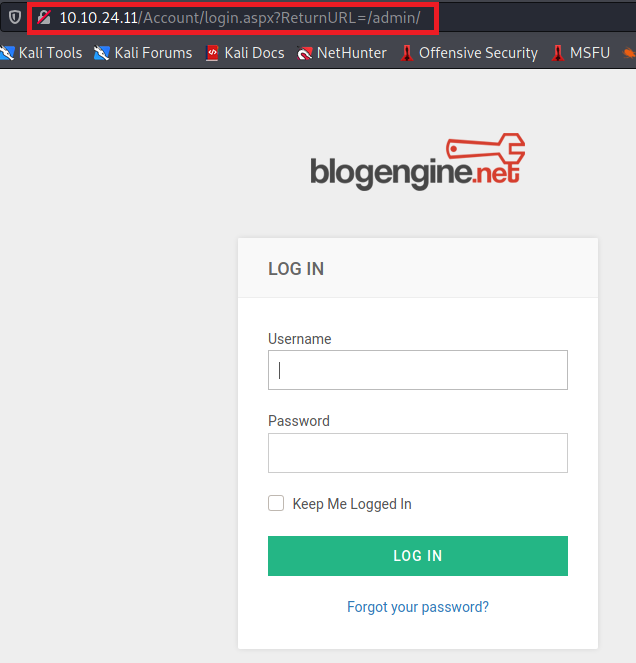

In order to brute force this the HTTP-POST-Form needs to be evaluated for the user name and password fields.  This can be achieved using Burp Suite

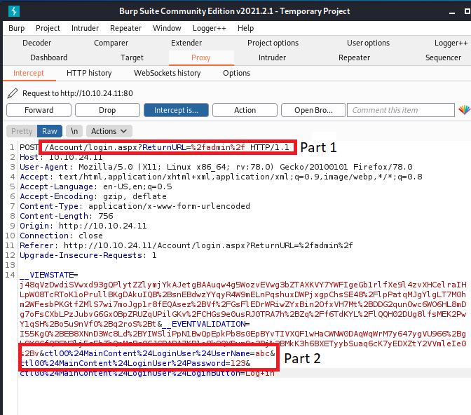

For Hydra to crack the password it needs to have the following .


​                                                            

Now we know the request type and have a URL for the login form, we can get started brute-forcing an account. 

EDIT: The original picture of the HTTP-POST-Form was incorrect it turns out that more information is needed. The entire selection below, including the **VIEWSTATE and EVENTVALIDATION** is what is needed for the user name and password fields. 

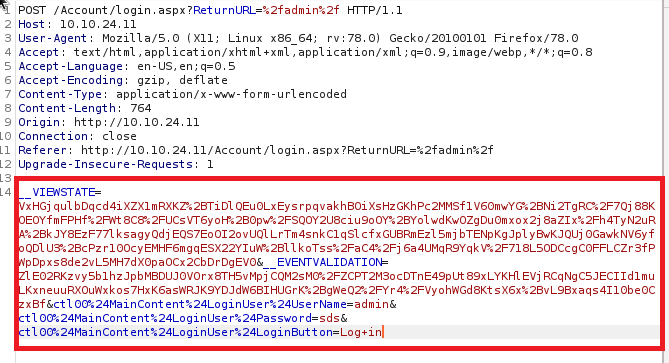

```hydra -l <username> -P /usr/share/wordlists/<wordlist> <ip> http-post-form```

The http-post-form needs to have the following format 

<Login Page URL\>:<Username Field\>=^USER^&<Password Field\>=^PASS^&Login=Login:<Login Failure message\>

In this case

Login Page URL = /Account/login.aspx

Username Field & Password Field & Login =


Login Failure Message = 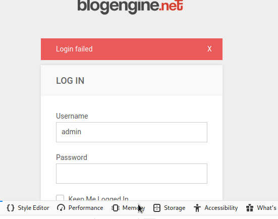

Now with this information Hydra can be used to brute force the password.

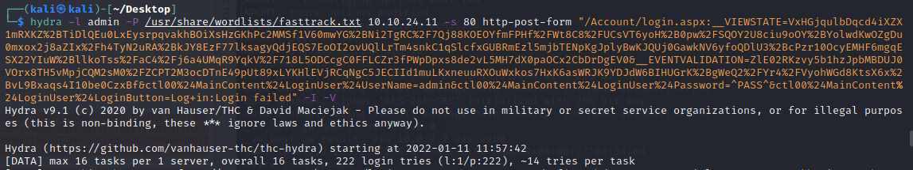

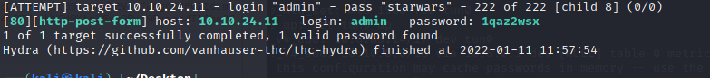

Hydra successfully forced the password!

Now with the password we can login to the website and get to work.

Login into the website we find that it is running BlogEngine 3.3.6.0, with this we can find an exploit on Exploit Database (EDB). EDB shows us that CVE-2019-6714 can be used to exploit the server. 

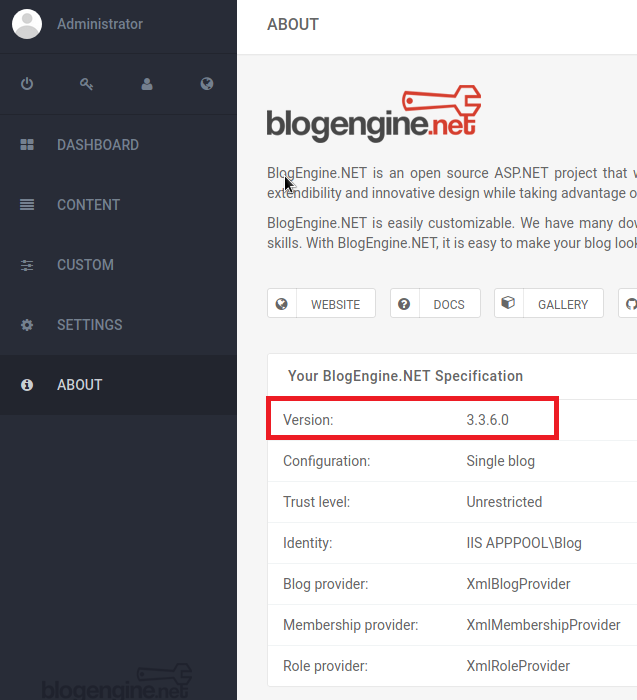

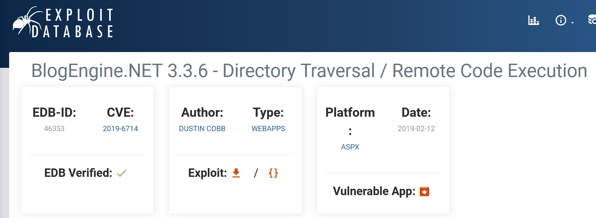

The exploit explains how to upload the file via a specific URL. The file then can be attached and posted to the website.

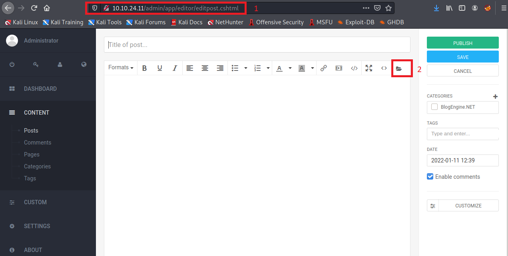

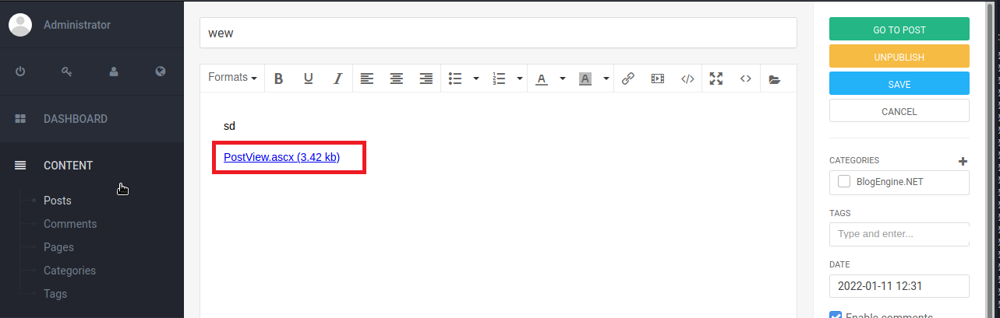

With the file successfully uploaded the exploit is run by entering a theme override into the URL. 

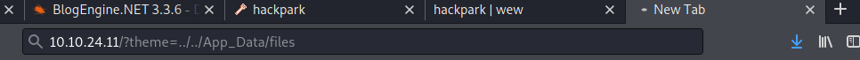

And with this we get a shell!

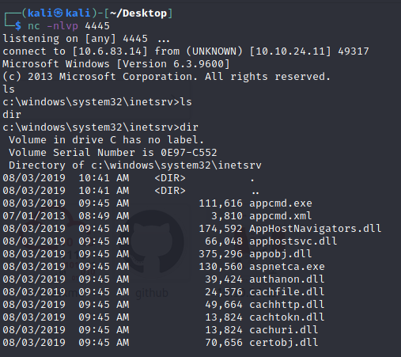

This shell is nice to have but we want some more privileges. Lets use Metasploit to enumerate the system and get root access. The Following steps need to be taken. 

1. Create a reverse shell payload with msfvenom
2. Set up a listener on Metasploit
3. Possibly host a server with this payload
4. Upload this payload to the web server
   1. Having some issues uploading the file
   2. Looked up online that powershell -c should work with wget.
   3. Realized that I **didn't have write permissions** in the current working directory and had to change it to C:\Windows\Temp to upload the file
   4. Had trouble downloading winPEA.bat, so had to use the RAW format that is found on GitHub. After using the RAW URL the file was downloaded as a DOS batch file which then successfully ran on the target machine. 

Using winPEAS.bat we find that there is a service running that allows Everyone to modify it. winPEAS has a read me that included the following

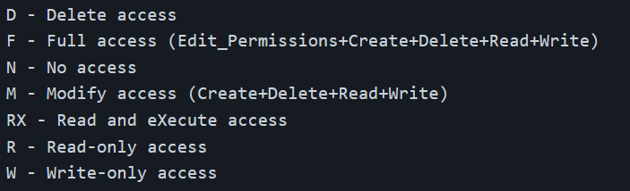

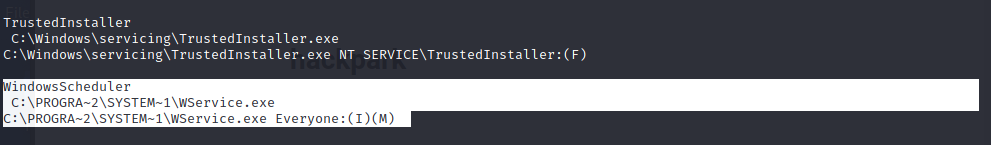

The WindowsScheduler contains a service WService.exe that allows everyone to Create, Delete, Modify and Write to it. 

We have to look at the logs to find that there is a Message.exe that is constantly stopping and restarting. This is how we can gain a root shell. 

By uploading a reverse shell onto the machine and renaming it Messages.exe we can escalate to root

